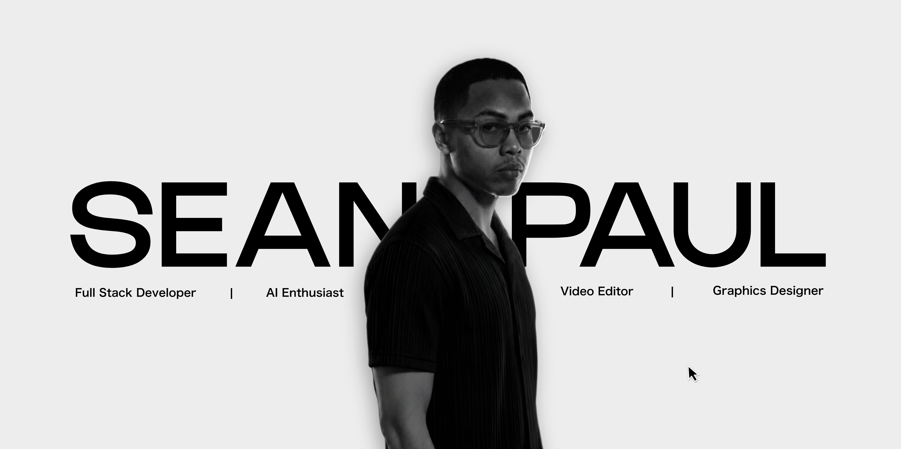
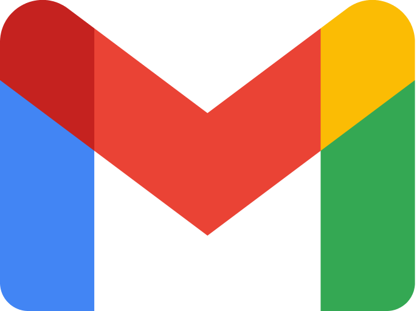
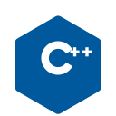
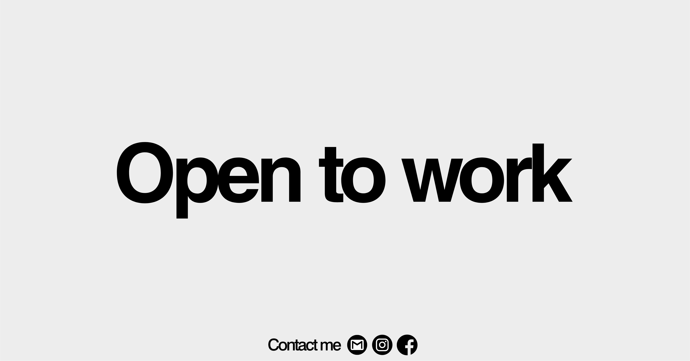

  

  

<h2 align="center">🛠️ My Tech Stack</h2>

<table align="center">
<tr>
<td width="440" valign="top" align="center">

<h3 align="center">🤖 AI</h3>

  &nbsp;&nbsp;
  &nbsp;&nbsp;
  &nbsp;&nbsp;
  

<h3 align="center">🎬 Videos</h3>

  &nbsp;&nbsp;
  

<h3 align="center">🎨 Graphics</h3>

  &nbsp;&nbsp;
  &nbsp;&nbsp;
  

 

</td>
<td width="440" valign="top" align="center">

<h3 align="center">⚡ Workflow</h3>

  &nbsp;&nbsp;
  &nbsp;&nbsp;
  &nbsp;&nbsp;
  &nbsp;&nbsp;
  &nbsp;&nbsp;
  

<h3 align="center">💻 Frontend</h3>

  &nbsp;&nbsp;
  &nbsp;&nbsp;
  

<h3 align="center">⚙️ Backend</h3>

  &nbsp;&nbsp;
  &nbsp;&nbsp;
  &nbsp;&nbsp;
  &nbsp;&nbsp;
  &nbsp;&nbsp;
  

 

</td>
</tr>
</table>

<h2 align="center">📊 GitHub Analytics</h2>

  

  

<h2 align="center">🤝 Let's Connect and Collaborate</h2>

  &nbsp;&nbsp;
  &nbsp;&nbsp;
  &nbsp;&nbsp;
  

 

  <em>"Live. Laugh. Design. Edit. Code. Repeat."</em>

  

